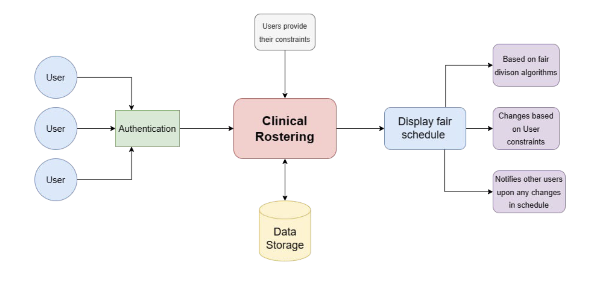

# Clinical Rostering

This project was made for [CloudPhysician](https://www.cloudphysician.net/) in collaboration with my teammates [Faizal Karim](https://github.com/FaizalKarim280280), [Utsav Shekhar](https://github.com/utsav-shekhar) and [Nandini Maroo]() as part of the course Design and Analysis of Software Systems offered at our institute.

In the project directory, you can run:

### `npm start`

Runs the app in the development mode.\
Open [http://localhost:3000](http://localhost:3000) to view it in your browser.

The page will reload when you make changes.\
You may also see any lint errors in the console.

### `npm test`

Launches the test runner in the interactive watch mode.\
See the section about [running tests](https://facebook.github.io/create-react-app/docs/running-tests) for more information.

### `npm run build`

Builds the app for production to the `build` folder.\
It correctly bundles React in production mode and optimizes the build for the best performance.

The build is minified and the filenames include the hashes.\
Your app is ready to be deployed!

See the section about [deployment](https://facebook.github.io/create-react-app/docs/deployment) for more information.

### `npm run eject`

**Note: this is a one-way operation. Once you `eject`, you can't go back!**

If you aren't satisfied with the build tool and configuration choices, you can `eject` at any time. This command will remove the single build dependency from your project.

Instead, it will copy all the configuration files and the transitive dependencies (webpack, Babel, ESLint, etc) right into your project so you have full control over them. All of the commands except `eject` will still work, but they will point to the copied scripts so you can tweak them. At this point you're on your own.

You don't have to ever use `eject`. The curated feature set is suitable for small and middle deployments, and you shouldn't feel obligated to use this feature. However we understand that this tool wouldn't be useful if you couldn't customize it when you are ready for it.

## Project Details

This project involves developing a web application which accepts data and constraints regarding the availability of all the nurses and physicians, analyzes the data and, with the help of various scheduling and fairness algorithms, provides the most optimized schedule for the end-users.

The system would be used by nurses in the hospitals. It can be extended to be used by physicians, pharmacists, dieticians, and other hospital staff. The set of users mentioned have busy schedules thus the interface needs to be easy to use and access, concise and shouldn’t take up a lot of time. The UI is user-friendly keeping in mind that the users might not be very proficient with technology.

